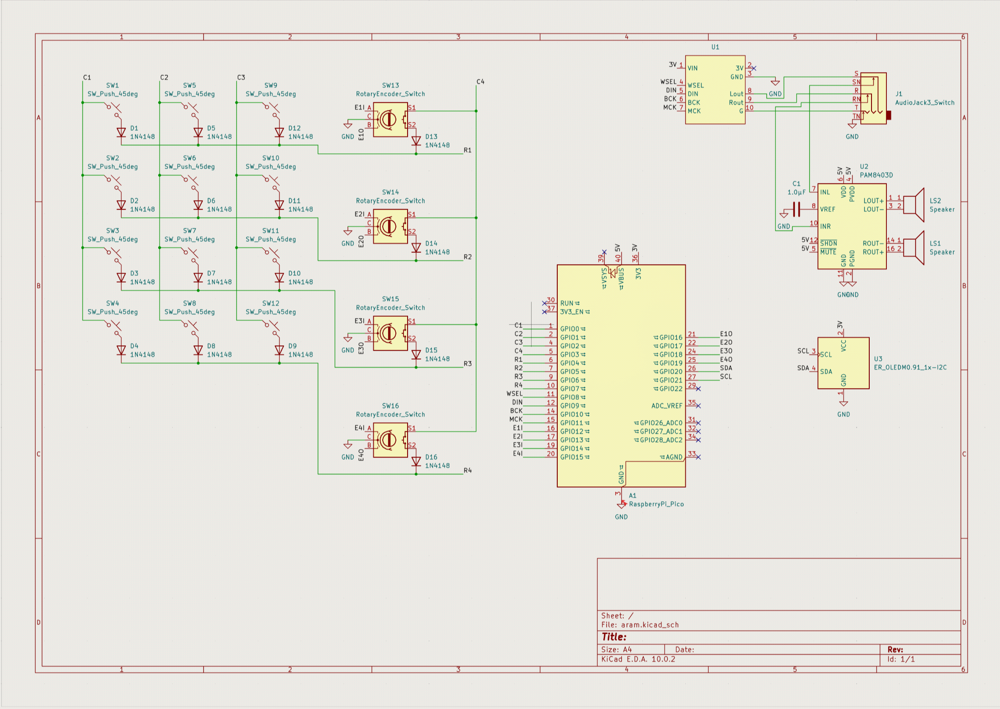
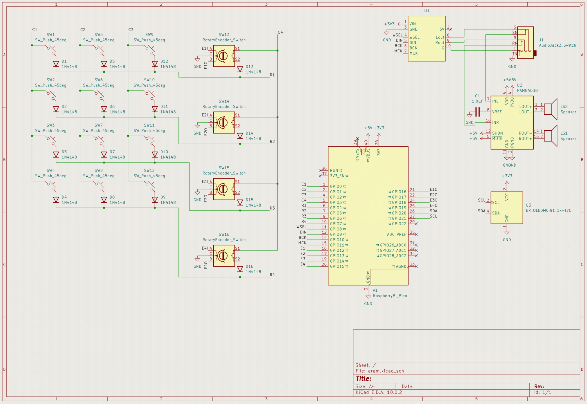

# Jun 24: PCB Schematic & Part Selection

I created the schematic for the keyboad. I originally planned for it to be modular, but thinking through how that would work, I realized it's probably better to keep it as one part for now, and then modularize and extend in future versions. I think I should be able to imitate what I wanted through software, however (e.g. custom "packages" you can upload to the keyboard that can stack or extend the keyboard functionality). With that in mind, instead of designating functionality for control knobs at the top, I just added 4 rotary encoder switches which hopefully will serve a number of uses that can be changed and customized. I meshed these switches with the keys, so I had a 4x4 matrix. I initially had the encoders on a separate matrix, but then I ran out of GPIO pins, so I added them to the keyboard matrix.

After making the keyboard matrix, I added the rest of the components. The matrix feeds into a Pico, which in turn powers and sends audio information to the Adafruit PCM5102 I2S DAC module. This creates an analog signal that is sent to a switchable audio jack. At first I thought I would just use the headphone jack on the PCM, but I realized then the keyboard could not play any audio. The switchable jack allows an external device to receive the audio signal, or alternatively get the sound played through the onboard speakers. I added an audio amplifier after the jack, which enables the sound to get played through the speakers. I chose the PAM8403 mainly because it was the cheapest of the options that came up when I searched for "audio amplifier chip". Finally, I also added an OLED screen to display any information, such as the current state of the 4 encoders, since there was a lot of freedom in what those could control.

After doing all this, I ran the ERC and found a couple errors. They all had to do with power output and input pins, which led me to discover that I made the symbol for the PCM5102 wrong, where GND was a power output pin and not an input pin. I also found out that I can use power symbols besides GND in KiCad. So, I replaced the 5V and 3V labels with the +5V and +3V3 power labels, respectively.

As I'm writing this, I'm realizing a couple things that I'll probably check out tomorrow or soon:
- There are no LEDs!! Lights may be helpful, especially in displaying the encoder states
- I need to figure out how the software side will work, I've never really done audio-related projects.
- I have zero confidence in the DAC --> headphone jack --> amplifier --> speaker pipeline. I should check the wiring and datasheets before I actually make the board layout.

A rough BOM for everything so far:
- 12 key switches (which I already have from an old project)
- 4 rotary encoder switches
- 16 diodes
- 1 RPI Pico
- 1 PCM5102 I2S DAC module
- 1 3.5mm headphone jack component (specific part tbd)
- 1 PAM8403(D?)
- 1 1.0μF 0805 Capacitor
- 2 Speakers (specific part tbd)
- 1 OLED (specific part tbd)

Initial schematic

Fixed schematic (with power symbols!)

**Total time spent: 5 hours**
